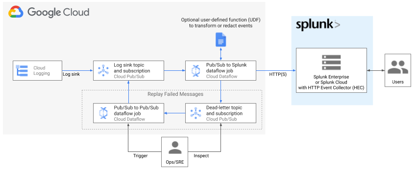
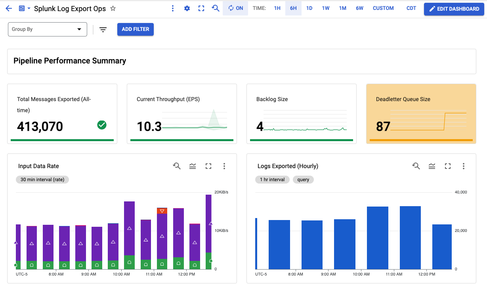

# Terraform templates for Google Cloud log export to Splunk

Terraform scripts for deploying log export to Splunk per Google Cloud reference guide:</br>
[Deploying production-ready log exports to Splunk using Dataflow](https://cloud.google.com/architecture/deploying-production-ready-log-exports-to-splunk-using-dataflow)
.

Resources created include an optional [Cloud Monitoring custom dashboard](#monitoring-dashboard-batteries-included) to monitor your log export operations. For more details on custom metrics in Splunk Dataflow template, see [New observability features for your Splunk Dataflow streaming pipelines](https://cloud.google.com/blog/products/data-analytics/simplify-your-splunk-dataflow-ops-with-improved-pipeline-observability).

These deployment templates are provided as is, without warranty. See [Copyright & License](#copyright-&-license) below.

### Architecture Diagram



### Configurable Parameters

Parameter | Description 
--- | ---
project | Project ID to deploy resources in
region | Region to deploy regional resources into. Must match `subnet`'s region if deploying into existing network (`create_network=false`) like a Shared VPC. See `subnet` parameter below.
create\_network | Boolean value specifying if a new network needs to be created.
network | Network to deploy into
subnet | Subnet to deploy into. This is **required** when deploying into existing network (`create_network=false`) like a Shared VPC.
primary\_subnet\_cidr | The CIDR Range of the primary subnet.
workspace | (Optional) Workspace to create Monitoring dashboard in. This assumes Workspace is already created and project is already added to it. If not specified, no dashboard will be created
log_filter | Log filter to use when exporting logs
splunk_hec_url | Splunk HEC URL to stream data to, e.g. https://[MY_SPLUNK_IP_OR_FQDN]:8088
splunk_hec_token | Splunk HEC token
dataflow_job_name | Dataflow job name. No spaces.
dataflow_job_machine_type | (Optional) Dataflow job worker machine type (default 'n1-standard-4')
dataflow_job_machine_count | (Optional) Dataflow job max worker count (default 2)
dataflow_job_parallelism | (Optional) Maximum parallel requests to Splunk (default 8)
dataflow_job_batch_count | (Optional) Batch count of messages in single request to Splunk (default 50)
dataflow_job_disable_certificate_validation | (Optional) Boolean to disable SSL certificate validation (default false)
dataflow_job_udf_gcs_path | (Optional) GCS path for JavaScript file (default No UDF used)
dataflow_job_udf_function_name | (Optional) Name of JavaScript function to be called (default No UDF used)
dataflow_template_version | (Optional) Dataflow template release version (default 'latest'). Override this for version pinning e.g. '2021-08-02-00_RC00'. Must specify version only since template GCS path will be deduced automatically: 'gs://dataflow-templates/`version`/Cloud_PubSub_to_Splunk'

### Monitoring Dashboard (Batteries Included)

Deployment templates include an optional Cloud Monitoring custom dashboard to monitor your log export operations:


### Getting Started

#### Requirements
* Terraform 0.13+

#### Enabling APIs
Before deploying the Terraform in a Google Cloud Platform Project, the following APIs must be enabled:
* Compute Engine API
* Dataflow API

For information on enabling Google Cloud Platform APIs, please see [Getting Started: Enabling APIs](https://cloud.google.com/apis/docs/getting-started#enabling_apis).

#### Setup working directory

1. Copy placeholder vars file `variables.yaml` into new `terraform.tfvars` to hold your own settings.
2. Update placeholder values in `terraform.tfvars` to correspond to your GCP environment and desired settings. See [list of input parameters](#configurable-parameters) above.
3. Initialize Terraform working directory and download plugins by running:

```shell
$ terraform init
```

#### Deploy log export pipeline

```shell
$ terraform plan
$ terraform apply
```

#### View log export monitoring dashboard (applicable if Monitoring Workspace parameter was provided)

 1. Retrieve dashboard id from terraform output
```shell
$ terraform output dataflow_log_export_dashboad
```
  The output is of the form `"projects/{project_id_or_number}/dashboards/{dashboard_id}"`.
  
  Take note of dashboard_id value.

 2. Visit newly created Monitoring Dashboard in Cloud Console by replacing dashboard_id in the following URL: https://console.cloud.google.com/monitoring/dashboards/builder/{dashboard_id}

#### Deploy replay pipeline

In the `replay.tf` file, uncomment the code under `splunk_dataflow_replay` and follow the sequence of `terraform plan` and `terraform apply`.

Once the replay pipeline is no longer needed (the number of messages in the PubSub deadletter topic are at 0), comment out `splunk_dataflow_replay` and follow the `plan` and `apply` sequence above.

### Cleanup

To delete resources created by Terraform, run the following then confirm:
``` shell
$ terraform destroy
```

### TODOs

* Support KMS-encrypted HEC token
* Expose logging level knob
* ~~Create replay pipeline~~
* ~~Create secure network for self-contained setup if existing network is not provided~~
* ~~Add Cloud Monitoring dashboard~~


### Authors

* **Roy Arsan** - [rarsan](https://github.com/rarsan)
* **Nick Predey** - [npredey](https://github.com/npredey)


### Copyright & License

Copyright 2021 Google LLC

Terraform templates for Google Cloud Log Export to Splunk are licensed under the Apache license, v2.0. Details can be found in [LICENSE](./LICENSE) file.
